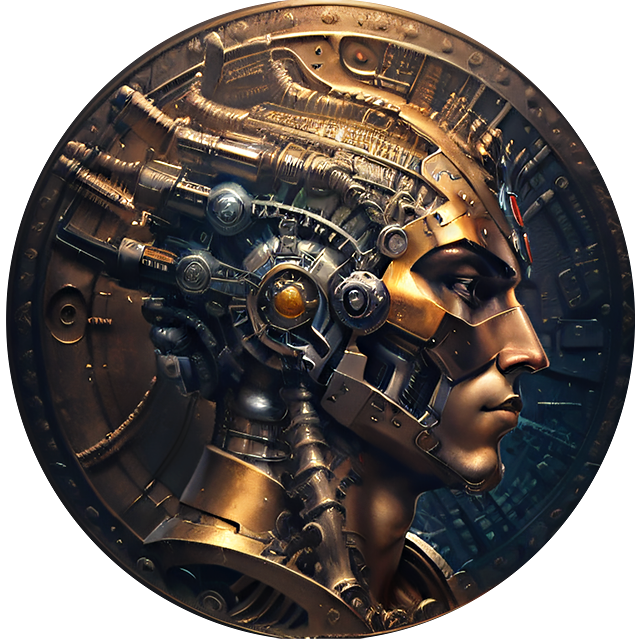

  

<h1 align="center">  Hermes EQ Agent - ERC20 StandAlone Version </h1>

 Hermes EQ Agent, is the final build of the prototype WalletEQ build, with input from Grok & an audit to improve and build it into a fully functional scanning agent, that is able to filter out the noise of MeVs, Wash trading bots, and other false positives, and find solid wallets & volume trading opportunities on the ERC Blockchain. 

  
  
  
  

  

---
